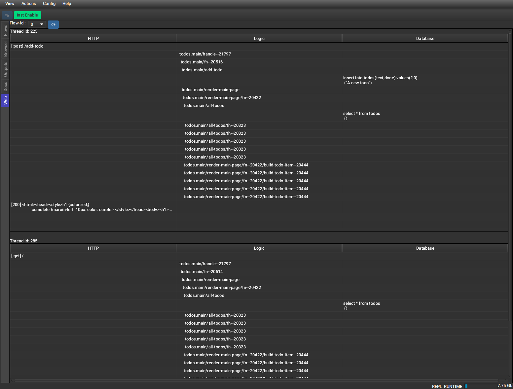

# FlowStorm web plugin



**Requires FlowStorm >= 4.3.0**

It currently supports and is tested with :

Web servers : 

- httpkit (2.8.0)
- ring-jetty-adapter (1.13.0)

Dabatabses libs :

- next.jdbc (1.3.994)
    
# Setup

[](https://clojars.org/com.github.flow-storm/flow-storm-web-plugin) 

In your deps.edn (same can be done with lein profiles) create an alias like :

```clojure
{...
 :aliases
 {...
  :fs-web-plugin {:extra-deps {com.github.flow-storm/flow-storm-web-plugin {:mvn/version "1.0.2"}}
                  :jvm-opts ["-Dclojure.storm.instrumentOnlyPrefixes.webPlugin=org.httpkit.server,ring.adapter.jetty,next.jdbc.result-set"
                             "-Dflowstorm.plugins.namespaces.webPlugin=flow-storm.plugins.web.all"]}
}}}
```

Then, in your projects, just make sure you start your repl with the `:fs-web-plugin` alias.

When you open the FlowStorm UI you should see a new `Web` tab like in the picture above.

Minimum instrumentation prefixes needed for each library :

- httpkit (`org.httpkit.server`)
- ring-jetty-adapter (`ring.adapter.jetty`)
- next.jdbc (`next.jdbc.result-set`)

# Usage

Record your activity as usual, then head to the Web tab, select the flow you recorded in and click refresh.

You should see one table per thread, and each table should contain the flow of the requests handled by that thread,
with the request, followed by your functions code and any sql statements down to the response.

Double clicking on any row should take you to that point in time in the code stepper.
