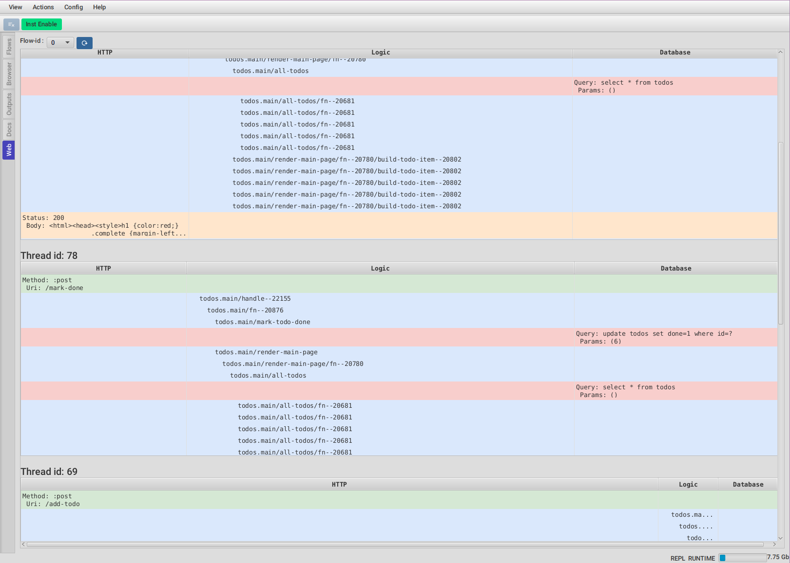

# FlowStorm web plugin



**WIP, it currently only support extracting information for http-kit (for the web part) and next.jdbc (for the database)**

# Installation

Add [](https://clojars.org/com.github.flow-storm/flow-storm-web-plugin) 
to your dependencies.

Then on some dev namespace :

```clojure
(require 'flow-storm.plugins.web.all)
```

When you open the FlowStorm UI you should see a new `Web` tab like in the picture above.

The plugin needs the recordings of the internals of http-kit and next.jdbc namespaces so your FlowStorm instrumentation should include 
the `org.httpkit` and `next.jdbc` prefixes added to your code prefixes, like `"-Dclojure.storm.instrumentOnlyPrefixes=next.jdbc,org.httpkit,todos,my-web-app-ns"`

# Usage

Just record your activity as usual, then head to the Web tab, select the flow you recorded in and click refresh.

You should see one table per thread, and each table should contain the flow of the requests handled by that thread,
with the request, followed by your code functions code and any sql statements down to the response.

Double clicking on any row should take you to that point in time in the code stepper.
